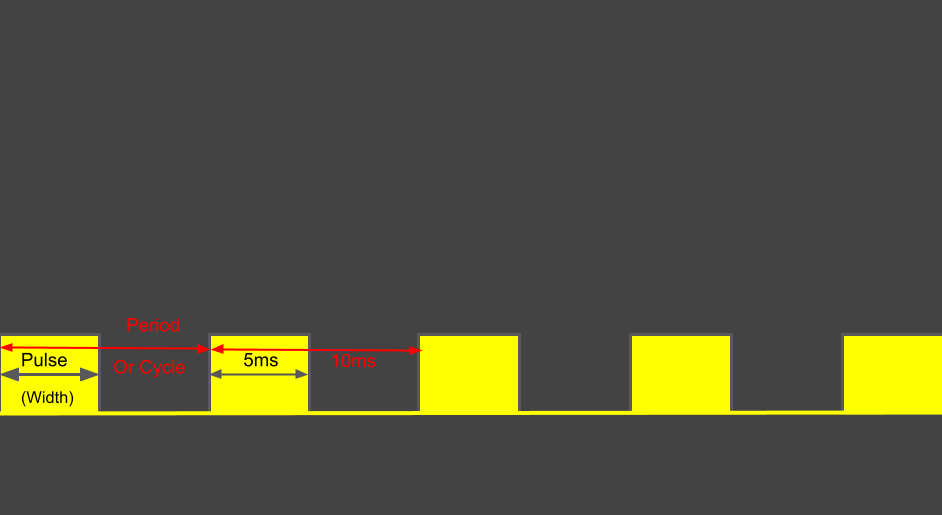

# PWM Mysteries Explained

The images from this passage come from [Pulse Width Modulation for Dummies](https://youngkin.github.io/post/pulsewidthmodulationraspberrypi/) by Rich Youngkin and [Introduction To PWM: How Pulse Width Modulation Works](https://www.kompulsa.com/introduction-pwm-pulse-width-modulation-works/) by Nicholas Brown

from [Pulse Width Modulation for Dummies](https://youngkin.github.io/post/pulsewidthmodulationraspberrypi/) by Rich Youngkin

## What is PWM?
&nbsp;&nbsp;&nbsp; Pulse Width modulation (PWM) is a digital substitue to an analog signal (such as resitors and transistors) that uses just the emount of engery that a device actually needs to run at the power you want it to. PWM is a way more effective alternative to resitors and transistors because in the use of a resitor or transitor, if the resitor is set to 50%, the other 50% left over simply turns into heat and is wasted. (Note that this could be useful in some cases, but most of the time we really don't want our computers heating up and wasting more energy.) 

&nbsp;&nbsp;&nbsp; PWM, instead of resiting the power it doesn't want the electronic device to take, it simply turns on and off *VERY* quickly (**VERY** quickly, like, thousands of times per second, very quickly. This is how the device reciving the power works at) so that the computer only gives the amount of power for the "ON" part of your loop and the device recives only the "ON" power. 

&nbsp;&nbsp;&nbsp; Anther great thing about PWM is that it is varible, and not static like a normal resistor is. This means that you can set the length of your Pulse Width to simulate amounts of power entering your device through duty cycle. You could set the Pulse Width to 50%, and that would give you about 50% power (when it pulses, it pulses with 50% of it's time "ON" and 50% of it time "OFF", if you gave it 75% duty cycle, it would be "ON" for 75% of it's time and "OFF" for 25%)

Most of the time PWM Signals are represented in sqaure waves, as seen below.
The high part of the wave would be the "ON", and the low part would be the "OFF". The higher the percentage you put in, the longer the top part will be, and the shorter the bottom part will be.

50% wave duty cycle from [Introduction To PWM: How Pulse Width Modulation Works](https://www.kompulsa.com/introduction-pwm-pulse-width-modulation-works/) by Nicholas Brown

